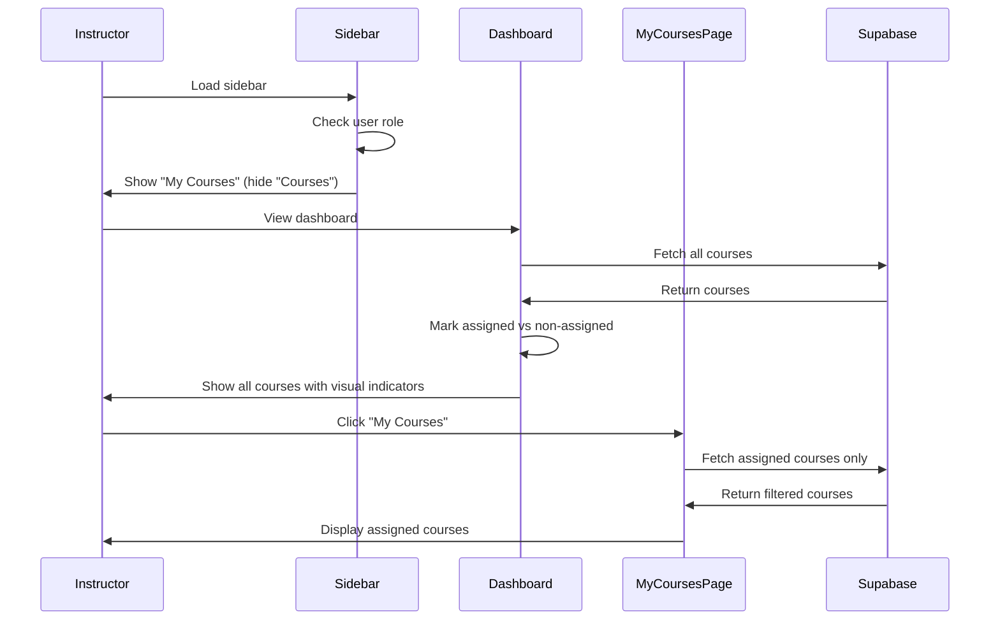

# Instructor Permissions Restriction - Design Document

## Overview

This feature restricts instructor account permissions to provide view-only access for non-assigned courses and removes course/student management capabilities.


The design follows a defense-in-depth approach with restrictions enforced at multiple layers:
- UI layer (hiding buttons and navigation)
- Component layer (conditional rendering based on role)
- Database layer (RLS policies)
- API layer (server-side validation)

## Architecture

### High-Level Architecture

```
┌─────────────────────────────────────────────────────────────┐
│                        Client Layer                          │
│  ┌──────────────┐  ┌──────────────┐  ┌──────────────┐      │
│  │   Sidebar    │  │  Dashboard   │  │  My Courses  │      │
│  │  Component   │  │    Home      │  │     Page     │      │
│  └──────────────┘  └──────────────┘  └──────────────┘      │
│         │                  │                  │              │
│         └──────────────────┴──────────────────┘              │
│                            │                                 │
│                            ▼                                 │
│                  ┌──────────────────┐                        │
│                  │  Role-Based      │                        │
│                  │  Access Control  │                        │
│                  └──────────────────┘                        │
└─────────────────────────────────────────────────────────────┘
                             │
                             ▼
┌─────────────────────────────────────────────────────────────┐
│                      Supabase Layer                          │
│  ┌──────────────┐  ┌──────────────┐  ┌──────────────┐      │
│  │     RLS      │  │   Database   │  │ Notifications│      │
│  │   Policies   │  │    Tables    │  │    System    │      │
│  └──────────────┘  └──────────────┘  └──────────────┘      │
└─────────────────────────────────────────────────────────────┘
```

### Component Interaction Flow



## Components and Interfaces

### 1. Sidebar Component Updates

**File**: `src/components/Sidebar.tsx`

**Changes Required**:
- Update menu groups for instructor role
- Replace "Courses" with "My Courses" for instructors
- Remove "Course Management" from instructor menu

**Interface**:
```typescript
interface MenuItem {
  id: PageType
  icon: JSX.Element
  label: string
  roles: string[]
  disabled?: boolean
}

// Updated menu structure for instructors
const instructorMenuGroups: MenuGroup[] = [
  {
    title: 'Teaching',
    roles: ['instructor'],
    items: [
      { id: 'my-courses', label: 'My Courses', ... },  // Changed from 'courses'
      { id: 'schedule', label: 'Schedule', ... }
    ]
  },
  {
    title: 'Management',
    roles: ['instructor'],
    items: [
      { id: 'user-management', label: 'My Students', ... }  // Read-only
    ]
  }
]
```

### 2. MyCoursesPage Component Updates

**File**: `src/components/pages/MyCoursesPage.tsx`

**Changes Required**:
- Extend to support instructor role (currently student-only)
- Filter courses based on subject assignments for instructors
- Maintain existing student functionality

**Interface**:
```typescript
interface MyCoursesPageProps {
  // No props needed - uses AuthContext
}

// Query logic for instructors
const fetchInstructorCourses = async (instructorId: string) => {
  // Get subjects where instructor is assigned
  const { data: subjects } = await supabase
    .from('subjects')
    .select('course_id')
    .eq('instructor_id', instructorId)
  
  // Get unique course IDs
  const courseIds = [...new Set(subjects.map(s => s.course_id))]
  
  // Fetch courses
  const { data: courses } = await supabase
    .from('courses')
    .select('*')
    .in('id', courseIds)
  
  return courses
}
```

### 3. DashboardHome Component Updates

**File**: `src/components/pages/DashboardHome.tsx`

**Changes Required**:
- Show all courses for instructors (not just assigned)
- Add visual indicators for assigned vs non-assigned courses
- Disable management actions for non-assigned courses

**Interface**:
```typescript
interface Course {
  id: string
  title: string
  description: string
  status: 'active' | 'inactive' | 'draft'
  is_assigned?: boolean  // New field for instructors
  is_manageable?: boolean  // New field for instructors
}

// Helper function to check if instructor is assigned
const isInstructorAssigned = async (courseId: string, instructorId: string): Promise<boolean> => {
  const { data } = await supabase
    .from('subjects')
    .select('id')
    .eq('course_id', courseId)
    .eq('instructor_id', instructorId)
    .limit(1)
  
  return (data?.length ?? 0) > 0
}
```

### 4. Schedule Request System

**New Component**: `src/components/pages/ScheduleRequestPage.tsx`

**Interface**:
```typescript
interface ScheduleRequest {
  id: string
  instructor_id: string
  course_id: string
  requested_date: string
  requested_time: string
  duration_minutes: number
  description: string
  status: 'pending' | 'approved' | 'rejected'
  reviewed_by?: string
  reviewed_at?: string
  rejection_reason?: string
  created_at: string
  updated_at: string
}

interface ScheduleRequestFormData {
  course_id: string
  requested_date: string
  requested_time: string
  duration_minutes: number
  description: string
}
```

### 5. Role-Based Access Control Utility

**New File**: `src/lib/permissions.ts`

**Interface**:
```typescript
type UserRole = 'admin' | 'developer' | 'instructor' | 'student'

interface PermissionCheck {
  canManageCourses: boolean
  canManageSubjects: boolean
  canManageModules: boolean
  canEnrollStudents: boolean
  canCreateSchedule: boolean
  canRequestSchedule: boolean
}

export const getPermissions = (role: UserRole): PermissionCheck => {
  switch (role) {
    case 'admin':
    case 'developer':
      return {
        canManageCourses: true,
        canManageSubjects: true,
        canManageModules: true,
        canEnrollStudents: true,
        canCreateSchedule: true,
        canRequestSchedule: false
      }
    case 'instructor':
      return {
        canManageCourses: false,
        canManageSubjects: false,
        canManageModules: false,
        canEnrollStudents: false,
        canCreateSchedule: false,
        canRequestSchedule: true
      }
    case 'student':
      return {
        canManageCourses: false,
        canManageSubjects: false,
        canManageModules: false,
        canEnrollStudents: false,
        canCreateSchedule: false,
        canRequestSchedule: false
      }
  }
}

export const canAccessCourseManagement = (role: UserRole): boolean => {
  return role === 'admin' || role === 'developer'
}

export const canManageCourse = async (
  userId: string,
  courseId: string,
  role: UserRole
): Promise<boolean> => {
  if (role === 'admin' || role === 'developer') return true
  if (role === 'instructor') {
    // Check if instructor is assigned to any subject in this course
    const { data } = await supabase
      .from('subjects')
      .select('id')
      .eq('course_id', courseId)
      .eq('instructor_id', userId)
      .limit(1)
    return (data?.length ?? 0) > 0
  }
  return false
}
```

## Data Models

### New Table: schedule_requests

```sql
CREATE TABLE schedule_requests (
  id UUID PRIMARY KEY DEFAULT uuid_generate_v4(),
  instructor_id UUID NOT NULL REFERENCES profiles(id) ON DELETE CASCADE,
  course_id UUID NOT NULL REFERENCES courses(id) ON DELETE CASCADE,
  requested_date DATE NOT NULL,
  requested_time TIME NOT NULL,
  duration_minutes INTEGER NOT NULL CHECK (duration_minutes > 0),
  description TEXT NOT NULL,
  status TEXT NOT NULL DEFAULT 'pending' CHECK (status IN ('pending', 'approved', 'rejected')),
  reviewed_by UUID REFERENCES profiles(id) ON DELETE SET NULL,
  reviewed_at TIMESTAMP WITH TIME ZONE,
  rejection_reason TEXT,
  created_at TIMESTAMP WITH TIME ZONE DEFAULT NOW(),
  updated_at TIMESTAMP WITH TIME ZONE DEFAULT NOW()
);

-- Indexes for performance
CREATE INDEX idx_schedule_requests_instructor ON schedule_requests(instructor_id);
CREATE INDEX idx_schedule_requests_status ON schedule_requests(status);
CREATE INDEX idx_schedule_requests_course ON schedule_requests(course_id);

-- RLS Policies
ALTER TABLE schedule_requests ENABLE ROW LEVEL SECURITY;

-- Instructors can view their own requests
CREATE POLICY "Instructors can view own schedule requests"
  ON schedule_requests FOR SELECT
  USING (auth.uid() = instructor_id);

-- Instructors can create schedule requests
CREATE POLICY "Instructors can create schedule requests"
  ON schedule_requests FOR INSERT
  WITH CHECK (
    auth.uid() = instructor_id AND
    EXISTS (
      SELECT 1 FROM profiles
      WHERE id = auth.uid() AND role = 'instructor'
    )
  );

-- Admins and developers can view all requests
CREATE POLICY "Admins can view all schedule requests"
  ON schedule_requests FOR SELECT
  USING (
    EXISTS (
      SELECT 1 FROM profiles
      WHERE id = auth.uid() AND role IN ('admin', 'developer')
    )
  );

-- Admins and developers can update requests (approve/reject)
CREATE POLICY "Admins can update schedule requests"
  ON schedule_requests FOR UPDATE
  USING (
    EXISTS (
      SELECT 1 FROM profiles
      WHERE id = auth.uid() AND role IN ('admin', 'developer')
    )
  );
```

### Updated RLS Policies

**courses table**:
```sql
-- Instructors can view all courses (read-only)
CREATE POLICY "Instructors can view all courses"
  ON courses FOR SELECT
  USING (
    EXISTS (
      SELECT 1 FROM profiles
      WHERE id = auth.uid() AND role = 'instructor'
    )
  );

-- Only admins/developers can modify courses
CREATE POLICY "Only admins can modify courses"
  ON courses FOR ALL
  USING (
    EXISTS (
      SELECT 1 FROM profiles
      WHERE id = auth.uid() AND role IN ('admin', 'developer')
    )
  );
```

**subjects table**:
```sql
-- Instructors can view subjects in their assigned courses
CREATE POLICY "Instructors can view assigned subjects"
  ON subjects FOR SELECT
  USING (
    EXISTS (
      SELECT 1 FROM profiles
      WHERE id = auth.uid() AND role = 'instructor'
    )
  );

-- Only admins/developers can modify subjects
CREATE POLICY "Only admins can modify subjects"
  ON subjects FOR ALL
  USING (
    EXISTS (
      SELECT 1 FROM profiles
      WHERE id = auth.uid() AND role IN ('admin', 'developer')
    )
  );
```

**modules table**:
```sql
-- Instructors can view modules in their assigned courses
CREATE POLICY "Instructors can view assigned modules"
  ON modules FOR SELECT
  USING (
    EXISTS (
      SELECT 1 FROM profiles p
      JOIN subjects s ON s.instructor_id = p.id
      WHERE p.id = auth.uid() 
        AND p.role = 'instructor'
        AND s.id = modules.subject_id
    )
  );

-- Only admins/developers can modify modules
CREATE POLICY "Only admins can modify modules"
  ON modules FOR ALL
  USING (
    EXISTS (
      SELECT 1 FROM profiles
      WHERE id = auth.uid() AND role IN ('admin', 'developer')
    )
  );
```

**course_enrollments table**:
```sql
-- Instructors can view enrollments for their assigned courses
CREATE POLICY "Instructors can view assigned course enrollments"
  ON course_enrollments FOR SELECT
  USING (
    EXISTS (
      SELECT 1 FROM profiles p
      JOIN subjects s ON s.instructor_id = p.id
      WHERE p.id = auth.uid() 
        AND p.role = 'instructor'
        AND s.course_id = course_enrollments.course_id
    )
  );

-- Only admins/developers can modify enrollments
CREATE POLICY "Only admins can modify enrollments"
  ON course_enrollments FOR ALL
  USING (
    EXISTS (
      SELECT 1 FROM profiles
      WHERE id = auth.uid() AND role IN ('admin', 'developer')
    )
  );
```

